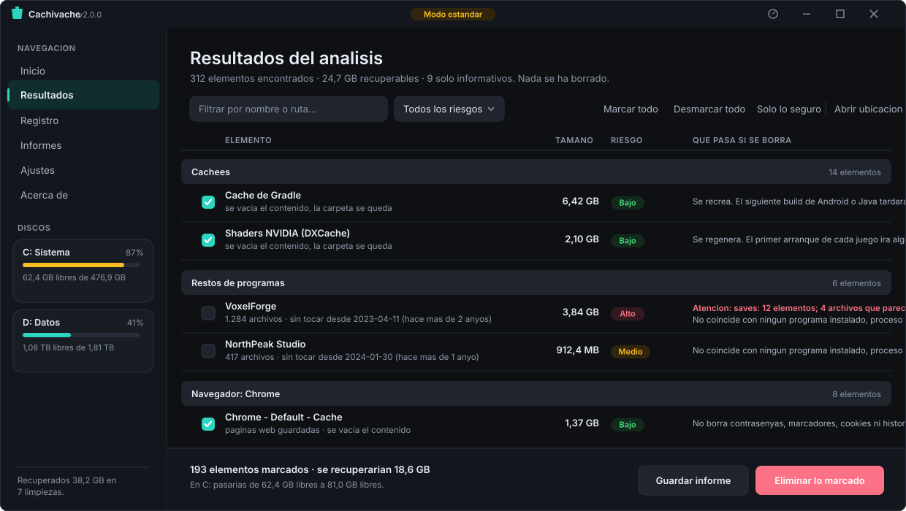

<p align="center">
  
</p>

<h1 align="center">Cachivache</h1>

<p align="center"><strong>Libera espacio en Windows sin romper nada.</strong><br>
Analiza el equipo, te enseña exactamente qué ha encontrado y por qué, y solo borra lo que tú marques.</p>

<p align="center">
  <a href="#empezar"></a>
  <a href="#empezar"></a>
  <a href="LICENSE"></a>
  
  
</p>

<p align="center">
  
</p>

---

## Empezar

**Requisitos: ninguno.** Windows 10 u 11 con PowerShell 5.1, que ya viene puesto. No hay instalador, no hay dependencias y no hay nada que compilar para poder usarlo.

**Opción A — descargar la última versión.** Bájate el `.zip` de la pestaña [**Releases**](https://github.com/pacolopez23/cachivache/releases), descomprímelo y haz doble clic en **`Cachivache.exe`**. Se abre el programa y ya está.

Cada versión publica el **SHA-256** de lo que adjunta, en la propia página de la versión y en un `SHA256SUMS.txt`. Si quieres comprobar que lo que has bajado es lo que se publicó:

```powershell
Get-FileHash .\Cachivache-v2.1.0.zip -Algorithm SHA256
```

y compara con la tabla de la página. Van en los dos sitios a propósito: quien pudiera cambiar el paquete podría cambiar también su archivo de sumas, pero no el texto de la versión.

**Opción B — con un gestor de paquetes.** Cada versión publica también su manifiesto de **Scoop** y el de **winget**, generados por la propia publicación con el hash del `.zip` que acaba de armar. Con Scoop se instala sin añadir ningún repositorio, apuntando directamente al manifiesto de la versión:

```powershell
scoop install https://github.com/pacolopez23/cachivache/releases/download/v2.1.0/cachivache.json
```

Los tres `.yaml` de winget van adjuntos a la versión, listos para enviar a `microsoft/winget-pkgs`; **todavía no está publicado ahí**, así que `winget install` aún no lo encuentra. El porqué de que los manifiestos se generen en vez de mantenerse a mano está en [`packaging/README.md`](packaging/README.md).

**Opción C — desde el código.**

```powershell
git clone https://github.com/pacolopez23/cachivache.git
cd cachivache
.\Cachivache.bat
```

Eso abre el programa. `Cachivache.bat` funciona siempre y no hay que preparar nada antes: deja una ventana de consola detrás, que en el primer arranque es útil porque cualquier fallo se lee ahí.

**Si lo vas a usar a menudo** y prefieres que no quede una consola detrás, genera el lanzador limpio una sola vez. Haz doble clic en **`tools\Crear-ejecutable.bat`** y aparecerá `Cachivache.exe` en esta carpeta. O desde PowerShell, que es lo mismo:

```powershell
.\tools\Compilar-Lanzador.ps1   # crea Cachivache.exe
.\Cachivache.exe                # el programa, sin consola detrás
```

Usa el compilador de C# que Windows ya trae. No hay que instalar nada.

<details>
<summary><strong>Qué hacer si algo no va</strong></summary>

<br>

**"No se puede cargar el archivo porque la ejecución de scripts está deshabilitada".** Es la política de ejecución de PowerShell. `Cachivache.bat` ya la esquiva por sí solo; si estás llamando al `.ps1` a mano, usa `powershell -ExecutionPolicy Bypass -File .\Cachivache.ps1`.

**"Windows protegió su PC" al abrir el `.exe`.** Es SmartScreen: el ejecutable no está firmado, y firmarlo cuesta dinero. Puedes generarlo tú mismo con el script de arriba, o usar el `.bat` y no tocar ningún binario.

**El `.exe` no se crea.** Vuelve a abrir `tools\Crear-ejecutable.bat` y lee la ventana, que se queda abierta a propósito: enseña la ruta del compilador, el código de salida y el error exacto. Las dos causas habituales son el **Acceso controlado a carpetas** de Windows Defender, si el proyecto está en el Escritorio o en Documentos, y un antivirus que se lleva el `.exe` recién creado. En cualquier caso, `Cachivache.bat` sigue abriendo el programa igual.

**Algo se comporta raro.** `.\Cachivache.ps1 -Diagnostico` vuelca versión, entorno, unidades y el final del registro, listo para pegar en una incidencia.

</details>

> **Se abre sin permisos de administrador a propósito.** Los cuatro módulos que los necesitan (`logs`, `windowsupdate`, `componentes` y `perfiles`, marcados como *admin* en la tabla de más abajo) aparecen atenuados hasta que pulses *Ajustes → Reiniciar como administrador*. Lo normal es ejecutar el programa con los permisos mínimos.

---

## Por qué otro limpiador

La mayoría de los limpiadores de disco te piden fe: pulsas un botón, se llenan unas barras y te dicen que has recuperado 12 GB. Qué eran esos 12 GB, ni idea.

Cachivache va al revés. Cada elemento que propone viene con tres cosas: **qué es**, **cuánto ocupa** y **qué pasa exactamente si lo borras**. Nada se borra sin que lo marques, nada arriesgado viene marcado de fábrica, y todo lo que hace queda registrado.

|  | Cachivache |
|---|---|
| **Explica cada elemento** | Qué es, cuánto ocupa y qué ocurre al borrarlo, en castellano llano |
| **Analiza sin tocar nada** | El análisis es de solo lectura. Borrar exige escribir una palabra |
| **Lista blanca, no lista negra** | Solo es borrable lo que cuelga de una carpeta autorizada explícitamente |
| **Papelera por defecto** | El borrado permanente hay que activarlo a propósito |
| **Sin dependencias** | PowerShell y WPF, que ya vienen con Windows. Nada que instalar |
| **Código legible** | Puedes leer exactamente qué hace antes de ejecutarlo |

---

## Por qué el `.exe` no está en el repositorio

Es a propósito, y por dos motivos.

El primero es de fondo: un binario dentro de un proyecto que presume de *"puedes leer exactamente qué hace antes de ejecutarlo"* sería justo lo contrario, porque nadie puede auditar un ejecutable leyendo el código. El segundo es práctico: un ejecutable pequeño, sin firmar y que arranca PowerShell tiene la forma exacta de un cuentagotas de malware, y los antivirus lo tratan como tal con frecuencia.

Así que lo compila la integración continua a partir del código etiquetado y lo adjunta a cada versión publicada — hay constancia pública de que salió de aquí. Es un lanzador de unos 45 KB, de los cuales la mayor parte es el icono, y sin nada del programa dentro: todo lo que hace está en [`tools/Compilar-Lanzador.ps1`](tools/Compilar-Lanzador.ps1), en unas cuarenta líneas de C#.

---

## Cómo se usa

1. **Elige un perfil.** Conservador toca solo lo que el sistema regenera. Equilibrado añade restos de programas y descargas antiguas. Exhaustivo (`agresivo` internamente) lo analiza todo, incluidos duplicados.
2. **Pulsa Analizar.** No se borra nada. Cada módulo se ejecuta en segundo plano y puedes cancelar cuando quieras.
3. **Revisa los resultados.** Vienen agrupados por categoría, con una etiqueta de riesgo y una explicación de qué pasa si borras cada cosa. Lo que lleva aviso sale en rojo y sin marcar.
4. **Elimina lo que quieras.** Todo va a la papelera salvo que actives el borrado permanente. Hay que escribir `ELIMINAR` para confirmar solo si hay algo de riesgo medio/alto marcado o si activaste el borrado permanente; si no, basta con `SI`.

### Atajos de teclado

| Tecla | Qué hace |
|---|---|
| `F5` | Analizar |
| `Ctrl+F` | Ir a Resultados y escribir en el filtro |
| `Ctrl+A` | Marcar todo lo visible (dentro de un cuadro de texto sigue seleccionando el texto) |
| `Esc` | Cancelar el análisis o detener la eliminación en curso |
| `Ctrl+1` … `Ctrl+6` | Los seis paneles, en el orden de la barra lateral |

**`Supr` no elimina, a propósito.** En una tabla esa tecla significa *"borra esta fila"*, y aquí querría decir *"borra todo lo marcado"*. Eliminar es un gesto deliberado: se hace desde su botón.

---

## Modo consola

Para automatizar o para quien prefiera la terminal:

```powershell
# Ver los módulos disponibles
.\Cachivache.ps1 -Listar

# Analizar sin borrar nada y guardar un informe
.\Cachivache.ps1 -Consola -Perfil conservador -Informe .\informe.html

# Vaciar solo cachés de aplicaciones y de navegadores
.\Cachivache.ps1 -Consola -Modulos caches,navegadores -Ejecutar

# Análisis silencioso para una tarea programada
.\Cachivache.ps1 -Consola -Silencioso -Informe C:\informes\semanal.csv
```

**En modo consola `-Ejecutar` solo elimina lo que el análisis había marcado por su cuenta**, es decir, elementos de riesgo bajo y sin avisos. Lo que exige criterio humano nunca se borra sin humano.

| Parámetro | Qué hace |
|---|---|
| `-Consola` | Trabaja en la terminal en lugar de abrir la ventana |
| `-Perfil` | `conservador`, `equilibrado`, `agresivo` o `personalizado` |
| `-Modulos` | Módulos concretos, separados por comas |
| `-Ejecutar` | Elimina de verdad. Sin esto, solo analiza |
| `-Permanente` | Borra sin pasar por la papelera |
| `-Informe` | Ruta del informe. La extensión decide el formato: `.html`, `.csv` o `.json` |
| `-Listar` | Muestra los módulos disponibles y termina |
| `-Silencioso` | No escribe nada por pantalla |
| `-Diagnostico` | Vuelca version, entorno, unidades y las ultimas lineas del registro, listo para pegar en una incidencia |

---

## Qué analiza

21 módulos independientes. Los marcados como **solo informa** nunca borran nada: se limitan a enseñarte dónde se está yendo el disco y cómo recuperarlo desde el propio Windows.

| Módulo | Qué busca | Riesgo |
|---|---|---|
| `caches` | Cachés de npm, Gradle, pip, NuGet, Cargo, shaders, Discord, Spotify, VS Code, Adobe… | Bajo |
| `navegadores` | Caché por perfil de Chrome, Edge, Brave, Opera, Opera GX, Vivaldi, Yandex y Chromium. Firefox lo cubre `caches` | Bajo |
| `proyectos` | `node_modules`, `dist`, `target`, `__pycache__`, `.venv`… | Bajo |
| `papelera` | Papelera de reciclaje de las unidades que tengas marcadas | Medio |
| `restos` | Carpetas de AppData que no corresponden a ningún programa instalado | Alto |
| `descargas` | Instaladores, ISOs y comprimidos antiguos en Descargas | Medio |
| `vacias` | Carpetas sin un solo archivo dentro | Bajo |
| `accesos` | Accesos directos `.lnk` cuyo destino ya no existe | Bajo |
| `temporales` | `.tmp`, `.bak`, `.old`, autoguardados de Office, `Thumbs.db` | Bajo |
| `duplicados` | Archivos idénticos por hash SHA-256 | Medio |
| `grandes` | Archivos grandes sin abrir desde hace mucho · **solo informa** | Alto |
| `logs` | Registros CBS, DISM, Panther, WER, volcados de memoria · *admin* | Bajo |
| `windowsupdate` | Paquetes de actualización ya aplicados · *admin* | Bajo |
| `componentes` | Compactación de WinSxS mediante DISM · *admin* | Medio |
| `sistema` | `hiberfil.sys`, `pagefile.sys`, puntos de restauración · **solo informa** | Alto |
| `dockerwsl` | Discos virtuales `.vhdx` de WSL y caché de Docker | Alto |
| `arranque` | Entradas de inicio, servicios y tareas rotas · **solo informa** | Medio |
| `perfiles` | Perfiles de usuario abandonados · *admin* · **solo informa** | Alto |

Detalle completo de cada uno en [`docs/MODULOS.md`](docs/MODULOS.md).

---

## Cómo evita romper el equipo

Toda la seguridad vive en un solo archivo, [`src/Core/Guard.ps1`](src/Core/Guard.ps1), para que se pueda auditar de una sentada.

**El modelo es de lista blanca.** Una ruta solo puede borrarse si cuelga de una carpeta que el módulo ha autorizado explícitamente. Todo lo demás se rechaza por defecto. Además, la propia carpeta autorizada nunca es borrable: solo lo que hay dentro.

Encima de eso, hasta siete comprobaciones más, según qué se cuente (la guardia aplica cinco automáticamente a cualquier ruta candidata; el módulo que la propone añade la lista blanca de raíces, el veto de enlaces simbólicos y el veto por extensión personal; el filtro de nombres sensibles lo aplican por su cuenta los módulos de más riesgo, hoy solo `restos`, no es automático para todos). Cualquiera de ellos veta:

1. **Forma de la ruta.** Rutas de menos de 15 caracteres, raíces de unidad, recursos de red y travesías con `..`.
2. **Lista negra de rutas.** Windows, System32, WinSxS, Archivos de programa, ProgramData, la raíz de AppData, y las carpetas personales resueltas en tiempo de ejecución (respetando OneDrive y Windows en cualquier idioma). También se rechaza cualquier ruta que sea *antecesora* de una de ellas: borrar `C:\Users` se llevaría el perfil entero por delante.
3. **Fragmentos prohibidos.** `\system32\`, `driverstore`, `\microsoft\crypto\`, `\.ssh\`, `\.aws\`, `\microsoft\vault\`…
4. **Carpetas personales estén donde estén.** Si el último tramo de la ruta se llama Documentos, Escritorio, Descargas, Imágenes, Fotos, Música o Vídeos, se veta aunque esté en `D:\` y no aparezca en ninguna lista.
5. **Carpetas de copias de seguridad**, en cualquier punto de la ruta. Una carpeta llamada `backup` contiene, por definición, lo que su dueño no quiere perder.
6. **Nombres sensibles** *(lo aplica el módulo `restos` por su cuenta, no toda la guardia automáticamente)*. Antivirus, gestores de contraseñas, monederos de criptomonedas, clientes de sincronización, herramientas de copia de seguridad, correo y banca.
7. **Extensiones personales.** Documentos, fotos, vídeo, partidas guardadas, proyectos creativos, certificados y bases de datos de contraseñas.

El único punto del programa que levanta el filtro 7 es el módulo de duplicados, y solo porque ha comprobado por hash SHA-256 que existe otra copia byte a byte idéntica y siempre conserva la más antigua: borrar una de dos copias iguales no pierde información. Ningún otro módulo puede hacerlo.

Y tres decisiones de diseño que importan tanto como los filtros:

- **La comprobación se repite justo antes de borrar.** No basta con que la ruta fuera segura durante el análisis: se revalida contra las mismas raíces en el momento de la eliminación. Si algo ha cambiado entre medias, se bloquea.
- **Se vacía el contenido, no la carpeta.** Muchos programas fallan si su carpeta de caché desaparece. Salvo cuando el objetivo es la carpeta en sí, se borra elemento a elemento y el contenedor sobrevive.
- **Nunca se sigue un enlace simbólico.** Los junctions y symlinks se detectan y se saltan, porque borrar el enlace podría arrastrar un destino que está en cualquier otro sitio.

**Lo que este programa no hace, y no va a hacer:** no escribe en el registro de Windows, no desinstala programas, no toca WinSxS a mano, no borra `Windows.old`, no elimina perfiles de usuario ni puntos de restauración. Cuando algo de eso conviene, lo dice y explica cómo hacerlo desde Windows.

Las [pruebas de la guardia](tests/Guard.Tests.ps1) son la especificación ejecutable de todo esto: cada una describe una ruta que el programa debe bloquear, o una que debe seguir alcanzando para no quedarse inútil.

---

## Dónde se guardan las cosas

El programa no escribe nada dentro de su propia carpeta, para que el repositorio se pueda clonar en solo lectura.

```
%LOCALAPPDATA%\Cachivache\
├── preferencias.json      ajustes, tema y perfil
├── historial.json         las 100 últimas ejecuciones
├── registros\             un .log por mes, con marca de tiempo
└── informes\              informes HTML, CSV y JSON
```

Cada análisis y cada limpieza guardan aquí su informe automáticamente. La pestaña **Informes** los lista por formato y los abre; el historial de la misma pestaña enlaza cada ejecución con el suyo. El programa sólo abre archivos `.html`, `.csv` y `.json` de esta carpeta: nada más, y nunca un enlace que apunte fuera de ella.

---

## Arquitectura

```
Cachivache.exe              lanzador sin consola (lo genera tools/, no se versiona)
Cachivache.bat              lanzador de respaldo, deja la consola a la vista
Cachivache.ps1              punto de entrada: argumentos, carga y arranque
src/
├── Core/
│   ├── Bootstrap.ps1      carga el núcleo en el ámbito de quien lo invoca
│   ├── Guard.ps1          guardia de seguridad
│   ├── Remove.ps1         motor de eliminación
│   ├── Candidate.ps1      contrato de candidato y de módulo
│   ├── ModuleRegistry.ps1 descubrimiento y ejecución de módulos
│   ├── Comandos.ps1       qué programas externos se pueden lanzar
│   └── …                  formato, disco, registro, perfiles, informes
├── Modules/               un archivo por categoría de limpieza
├── UI/                    armazón, un .xaml por panel, temas y lógica
└── Cli/                   modo consola
tests/                     Suite de Pester
tools/                     Crear-ejecutable.bat y el script que compila el lanzador
docs/                      arquitectura, módulos, rendimiento y prueba manual
assets/                    el icono: cachivache.svg es la fuente, .ico lo usa el .exe
```

**Añadir una categoría nueva es dejar caer un archivo en `src/Modules/`.** No hay ninguna lista central que mantener: el registro descubre los módulos solo. Cómo se escribe uno está en [`docs/ARQUITECTURA.md`](docs/ARQUITECTURA.md).

El análisis y la eliminación se ejecutan en runspaces aparte, de modo que la ventana nunca se congela y siempre se puede cancelar. La comunicación es una tabla hash sincronizada que un temporizador consulta cinco veces por segundo, así que todo lo que toca controles ocurre en el hilo de la interfaz.

---

## Desarrollo

```powershell
# Pruebas
Invoke-Pester ./tests

# Análisis estático
Invoke-ScriptAnalyzer -Path . -Recurse -Settings ./PSScriptAnalyzerSettings.psd1
```

Ambas cosas se ejecutan en cada push mediante GitHub Actions. Si tocas la guardia de seguridad, las pruebas de `tests/Guard.Tests.ps1` tienen que seguir pasando todas: no hay excepciones.

Cómo contribuir en [`CONTRIBUTING.md`](CONTRIBUTING.md).

[`docs/OPTIMIZACIONES.md`](docs/OPTIMIZACIONES.md) es la auditoría completa del código: todo lo que se puede mejorar, con archivo, línea, el cambio concreto y su riesgo. Empieza por ahí si buscas dónde meter mano.

---

## Pruébalo sin que borre nada

Un limpiador te pide que confíes en él antes de haberte dado ningún motivo. Así que primero enséñale a enseñarte lo que haría.

**En la ventana:** analiza, y antes de pulsar el botón marca la casilla **Solo simular** que hay a su lado. El botón deja de ser rojo y pasa a decir *Simular limpieza*.

**En la consola:**

```powershell
.\Cachivache.ps1 -Consola -Ejecutar -Simular
```

En los dos casos recorre todo lo que borraría, te dice cuánto espacio liberaría y lo deja anotado en el registro — **sin tocar un solo archivo**. Y no guarda informe de limpieza ni entrada en el historial, porque no ha ocurrido nada que registrar. Cuando la lista te convenza, desmarca la casilla o quita `-Simular`.

Si algo de lo que propone te sorprende, no lo borres: [cuéntalo](../../issues). Un falso positivo es la información más útil que puede recibir este proyecto.

---

## Carpetas que no se tocan nunca

Si el programa te propone una carpeta que quieres conservar, díselo una vez:

```powershell
.\Cachivache.ps1 -Consola -Excluir 'D:\Trabajo','C:\Proyectos\activo'
```

Excluir una carpeta excluye todo lo que cuelga de ella. Y se comprueba **dos veces**: al analizar y otra vez justo antes de borrar, porque entre una cosa y la otra puede pasar tiempo.

---

## Dónde se fue el espacio

Además de limpiar, Cachivache **enseña el disco**: el árbol de carpetas ordenado por tamaño y los archivos más grandes, sin proponer ni borrar nada.

```powershell
.\Cachivache.ps1 -Espacio                      # las carpetas del usuario
.\Cachivache.ps1 -Espacio C:\ -Profundidad 3    # una ruta concreta, tres niveles
.\Cachivache.ps1 -Espacio -Buscar *.iso        # solo las imágenes de disco
```

Con `-Informe` genera además un **mapa del disco** en HTML: cada carpeta es un rectángulo proporcional a lo que ocupa.

```powershell
.\Cachivache.ps1 -Espacio -Informe mapa.html
```

Y el color dice algo que un analizador de disco no puede decir: **cuánto de ese espacio sobra**. Las carpetas con cosas que se pueden limpiar se pintan según su riesgo; las que no tienen nada que limpiar, en gris.

Cuenta bien los **enlaces duros**: un archivo compartido por dos rutas ocupa el espacio una vez, no dos. Es la razón de que `WinSxS` parezca el doble de grande en casi todas las herramientas.

---

## Hacia dónde va

[`docs/HOJA-DE-RUTA.md`](docs/HOJA-DE-RUTA.md) explica en qué quiere ser mejor este programa que los demás limpiadores, qué le falta y en qué orden. Incluye lo que **no** se va a hacer y por qué —limpiador de registro, promesas de rendimiento, complementos de terceros—, que en un programa que borra archivos importa tanto como la lista de funciones.

Lo ya corregido está en [`docs/PLAN-ACCION.md`](docs/PLAN-ACCION.md).

---

## Licencia

**[Licencia MIT](LICENSE)** — software libre y de código abierto. Puedes usarlo, copiarlo, modificarlo, distribuirlo e incluso venderlo, gratis y sin pedir permiso. La única condición es conservar el aviso de copyright y el texto de la licencia en las copias.

Se ofrece **sin garantía de ningún tipo**, como dice el propio `LICENSE` en mayúsculas. Eso no es una fórmula vacía en un programa que borra archivos: sigue leyendo.

Dicho esto: **es un programa que borra archivos**. Está escrito con toda la prudencia que he sabido meterle y con pruebas que la respaldan, pero la responsabilidad de lo que borres en tu equipo es tuya. Empieza por el perfil conservador, lee lo que propone y ten una copia de seguridad de lo que no te puedas permitir perder.
